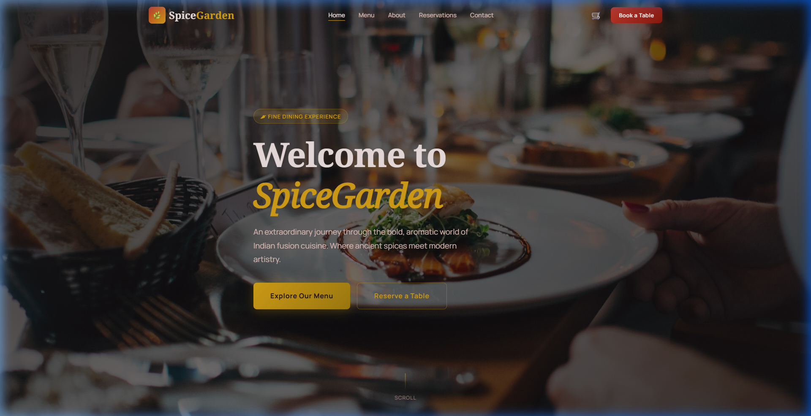
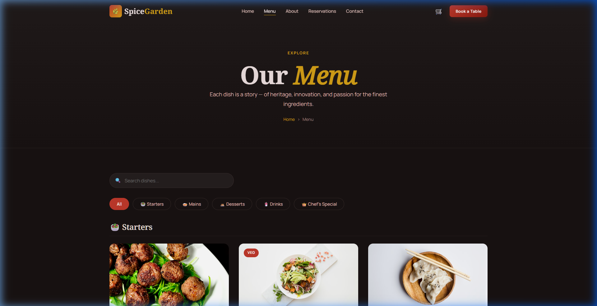
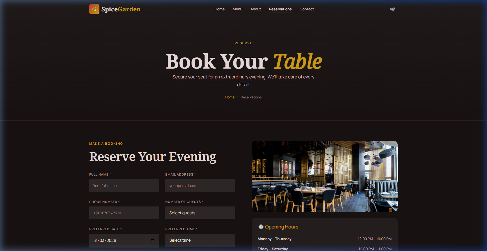
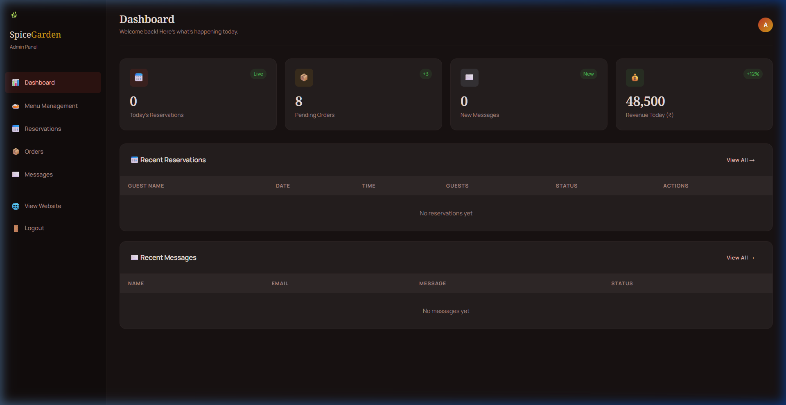

# SpiceGarden – Premium Indian Fusion Restaurant

> **An extraordinary culinary destination where traditional Indian spices meet contemporary artistry and innovation.**

SpiceGarden is a high-end restaurant web application that delivers a premium digital experience reflecting the brand's commitment to excellence. From interactive menus to seamless reservations, every detail is crafted to engage and delight the modern diner.

---

## 🚀 Vision

In a world of generic dining, SpiceGarden stands out by offering a **sensory journey**. Our platform translates the aroma and artistry of our kitchen into a digital format, ensuring that the guest's experience begins long before they walk through our doors.

---

## 🛠️ Key Technologies

- **Frontend**: Scalable, semantic architecture built with **HTML5** and **ES6+ JavaScript**.
- **Styling**: Modern **Vanilla CSS3** utilizing **Glassmorphism**, **CSS Grid**, and **Flexbox** for a bespoke look.
- **Animations**: Driven by **AOS (Animate on Scroll)** for a refined, premium feel.
- **Admin Engine**: Integrated **Management Console** for real-time tracking of reservations and inquiries.
- **Data Handling**: Optimized **Local Storage** integration for zero-latency data persistence in the demo environment.

---

## ✨ Core Capabilities

### 1. 🍽️ Dynamic Fusion Menu
A visually stunning, interactive menu that allows guests to explore dishes by category, view chef's recommendations, and see real-time price updates.

### 2. 📅 Intelligent Reservation System
A multi-step booking engine with real-time validation, ensuring that every table request is captured with precise guest details and preferences.

### 3. 🔐 Enterprise Admin Dashboard
A secure backend portal for restaurant managers to oversee the entire operation. Features include:
- **Reservation Lifecycle Management** (Confirm, Cancel, Archive).
- **Inquiry Handling** via the integrated messaging system.
- **Menu Control** for updating seasonal offerings instantly.

### 4. 🛒 Interactive Order Cart
A persistent cart system that allows guests to build their ideal meal virtually, creating high engagement and pre-order potential.

---

## 🖼️ UI Showcase

### 🏠 **Sophisticated Landing Page**
*A premium first impression featuring high-end glassmorphism and smooth, cinematic animations.*


### 📜 **Interactive Menu Experience**
*Where culinary art meets digital design. High-resolution imagery with seamless transitions.*


### 📅 **Seamless Booking Interface**
*A clean, conversion-optimized reservation form designed for maximum user convenience.*


### 📊 **Managerial Insights Dashboard**
*Complete control over restaurant operations through a high-performance admin interface.*


---

## 📥 Getting Started

1. **Clone the Project**:
   ```bash
   git clone [your-repo-link]
   cd spicegarden
   ```

2. **Launch Application**:
   - Simply open `index.html` in any modern web browser.
   - Recommended: **Google Chrome** for the best animation performance.

3. **Admin Access**:
   - URL: `admin/login.html`
   - **Credentials**: `admin` / `spice123`

---

## 📝 Project Details

- **Category**: Premium Web App / Restaurant Technology
- **Design Style**: Modern Indian Fusion / Glassmorphism
- **Developer**: Codverse Tech

---

<p align="center">Crafted with precision for the ultimate dining experience.</p>
